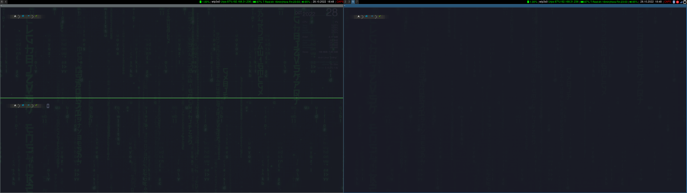

# i3-left_right_workspace

This Python3 script is ideal for multi-screen setups with the i3wm window manager.  
When using a setup with multiple monitors and the workspaces are messy like here.

Being in the workspace number 5 and if we wanted to go to number 3 we must first go through number 4, since i3wm does it in numerical order. With this script we change this behavior since it will change to the workspace on the left, that is, the number 3. In this way we also prevent the focus from changing monitors unnecessarily.

It should also work with the Sway window manager, though it hasn't been tested.

### Table of Contents
- [i3-left_right_workspace](#i3-left_right_workspace)
    - [Table of Contents](#table-of-contents)
- [Performance](#performance)
    - [Parameters:](#parameters)
- [Installation](#installation)
- [Requirements](#requirements)

# Performance

### Parameters:
+ **-r**    Move focus to workspace right.
+ **-l**    Move focus to workspace left.

# Installation

Clone this repository, go into the directory and give execute permissions to the file **i3-left_right_workspace.py**.

~~~
git clone https://github.com/casaenobras/i3-left_rigth_workspace
cd i3-left_right_workspace.py
chmod +x i3-left_right_workspace.py
~~~

Open the i3wm configuration file (usually located in **~/.3/config** or **~/.config/i3/config**) with your favorite editor. For example **vim**.  
~~~
vim ~/.config/i3/config
~~~

Change these lines
~~~
#navigate workspaces next / previous
bindsym $mod+Ctrl-Right workspace next
bindsym $mod+Ctrl-Left workspace previous
~~~
For these
~~~
#navigate workspaces next / previous
bindsym $mod+Ctrl+Right exec /<script path>/i3-left_rigth_workspace.py -r
bindsym $mod+Ctrl+Left exec /<script path/i3-left_rigth_workspace.py -l
~~~

Save the config file and reload your i3wm (by default `Mod+Shift+c` and then `Mod+Shift+r`) for the changes to take effect. 

# Requirements

See requirements.txt or execute

~~~
pip install -r requirements.txt
~~~