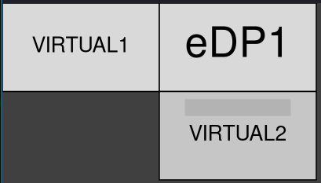

# i3-Swap_Monitors

This Python3 script is ideal for multi-screen setups with the i3wm window manager.
Use the i3ipc module and rotate the workspaces between the different screens regardless of their positions
and keeping them in the same order.  

It should also work with the Sway window manager, though it hasn't been tested.

### Table of Contents
- [i3-Swap_Monitors](#i3-swap_monitors)
    - [Table of Contents](#table-of-contents)
- [Performance](#performance)
    - [Parameters:](#parameters)
- [Installation](#installation)
- [Requirements](#requirements)

# Performance

### Parameters:
+ **-r**    Rotate the monitors in reverse order.
+ **-f**    The workspace that has focus will continue to have focus.

The default operation is to rotate the monitors from left to right and from top to bottom.
In a three monitor setup like this:

The rotation would be:
1. VIRTUAL1 --> eDP1
2. eDP1 --> VIRTUAL2
3. VIRTUAL2 --> VIRTUAL1

You can reverse the direction of rotation with the **-r** parameter.
By default the workspace with focus will always be the one visible on the primary monitor, in this case eDP1.
You can change this behavior with the parameter **-f**, the focus will be in the same workspace even if you rotate the monitors.  

# Installation

Clone this repository, go into the directory and give execute permissions to the file **i3-swap_monitors.py**.

~~~
git clone https://github.com/casaenobras/i3-swap_monitors
cd i3-swap_monitors
chmod +x i3-swap_monitors.py
~~~

Open the i3wm configuration file (usually located in **~/.3/config** or **~/.config/i3/config**) with your favorite editor. For example **vim**.  
~~~
vim ~/.config/i3/config
~~~

Add the script with your preferred keyboard shortcut, for example:
~~~
bindsym $mod+Tab exec /<script path>/i3-swap_monitors.py
~~~ 

With setups of three or more monitors it may be useful to add yet another keyboard shortcut with the script's reverse function to rotate the monitors in the other direction.

~~~
bindsym $mod+Ctrl+Tab exec /<script path>/i3-swap_monitors.py -r
~~~  

Save the config file and reload your i3wm (by default `Mod+Shift+c` and then `Mod+Shift+r`) for the changes to take effect. 

# Requirements

See requirements.txt or execute

~~~
pip install -r requirements.txt
~~~